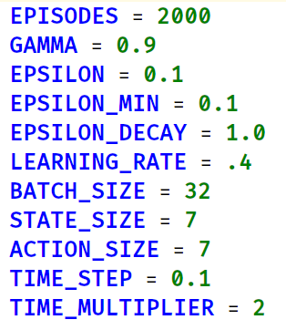
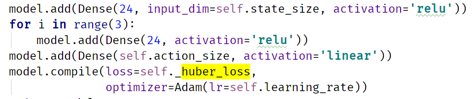
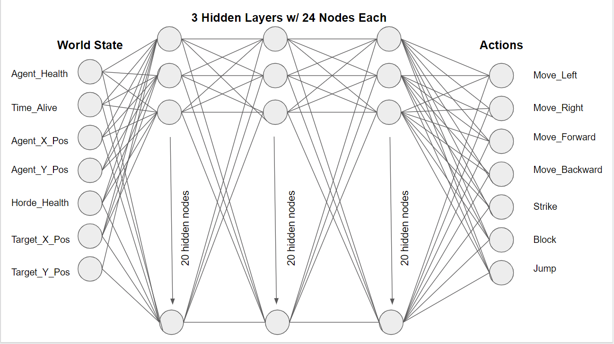
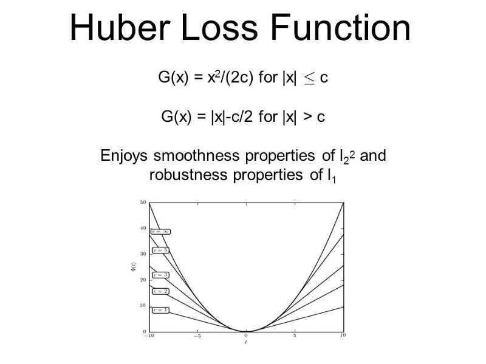
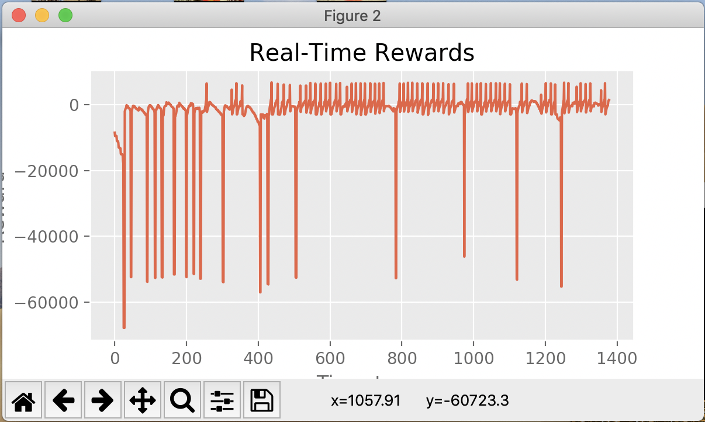
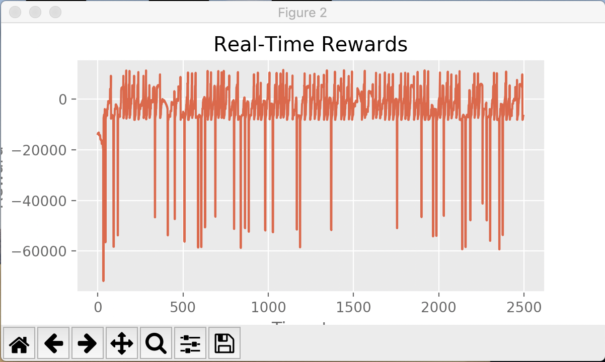

**Video Summary**:

<iframe width="560" height="315" src="https://www.youtube.com/embed/Kqv3A_9R5jg" frameborder="0" allow="accelerometer; autoplay; encrypted-media; gyroscope; picture-in-picture" allowfullscreen></iframe>

**Summary**:

Minecraft is more than a game that is centered around building and exploration. It has a vast combat system with a wide variety of weapons and mobs alike. Each mob is unique and requires a specific strategy to take down. Combat is dynamic meaning the game state that the player inhabits will always be affected by the actions the player and mobs take. With this in mind, there are hundreds of moves that can be made during any situation, but only a few are the most optimal. We believe that training an agent using reinforcement learning fundamentals will allow us to create the perfect combat player that will efficiently kill mobs in Minecraft.

Our goal with this project is to train an agent to efficiently take down hordes of zombies. To do this, our agent will be placed in an arena surrounded by lava and confronted by an N number of zombies. Armed with a sword, shield, and a suit of armor, our agent will have the option to move, strafe, jump, attack with a sword, and block with a shield in order to eliminate the hostile horde. The agent will utilize a Deep Q Learning Neural Network in order to determine the next best move in the given situation. Every action taken by the agent will be evaluated using a reward formula that factors the agent’s health, the horde’s health, agent position, enemy position, and the time passed since mission start. An effective agent would be classified as an agent that is able to clear out the arena quickly while also reducing the amount of damage it takes.

**Approach**:

The baseline for our agent was simply to be able to reasonably and efficiently kill a horde of zombies while surviving the encounter. Our original idea was to use a simple Q learning algorithm with no neural model to determine our agent’s next move. However, Minecraft’s dynamic combat system would create too many possible game states for the simple algorithm to handle. Due to this, we decided to utilize a Deep Q Learning Neural Network. This neural network begins by executing random moves that may result in a positive or negative reward. After each move, the neural network collects a memory of recent moves and forms a Q-table organized by the moves that generate the highest reward over time. This means our agent is able to learn from its mistakes as well as take measures to avoid performing moves that may lead to a poor outcome. After a significant training period, the agent has experienced a variety of possible game states and is able to predict the ideal action with reasonable accuracy.

In more specific high level detail, our approach involves consuming the world state (player_health, time_alive, player_x_pos, player_z_pos, horde_health, target_x_pos, target_z_pos), and feeding this state into our deep q network. The agent then performs an action based on the q network’s suggestion. The q network decides to perform an action randomly at a low probability, or alternatively, an action that is chosen from its memory / by the neural network if it is less familiar with the given state.

Once the selected action has been performed on the environment, the agent polls for the new state and a reward. The new state, reward, old state, and action performed are saved to the agent’s memory for reference when experiencing a similar state in the future. This feedback loop continues until the agent either kills the enemy, dies, or the mission times out. Upon death, extra reward is either awarded or subtracted in order to emphasize the importance of these states.

Our configuration for the neural network includes the following hyperparameters:

*Hyperparameters Used For the Model*

Our model generally starts to see success around episode 50-100 and is considered well trained around episode 200. We achieved this by a gamma of .9, making the agent more forward thinking. We also chose a random action to perform 10% of the time through our .1 epsilon. Epsilon decay is 1.0, which in our configuration means no decay. This parameter was included for experimentation but it did not end up improving our performance by much and only complicated our implementation. Our learning rate is fairly high at .4, which allows our agent to learn relatively quickly. Although this leads to less stable performance, it allowed us to iterate and test our agent quickly without compromising performance too much. Our batch size is set at 32, which means we sample 32 states/actions from our q queue to examine before taking action. Our state & action space are both 7 in size. We perform analysis & calculations 10 simes per second, so our time steps are .1 second. Finally, our agent runs at double speed for faster iteration and training, so we reduce all of our time sensitive operations by a factor of 2.

*Neural Net Configuration*

The code above is used to configure our neural network for our agent. The diagram below is a visual representation of our agent’s neural network including its inputs and outputs.

*Neural Net Diagram*

*Huber Loss Function*

Our neural network utilizes the huber loss function for its loss function. We chose the Huber Loss formula because this formula would allow our neural network to be less sensitive to outliers in the data.

**Evaluation**:

Every action taken by our agent results in a change somewhere in the environment, whether it be a change in position or a change in health values. Due to this, we decided to evaluate our agent after every single move in order for our agent to learn quickly and on the spot. The evaluation formula used after each action is: (player_health^2)*5 - (zombie_health^2)*5 - time_alive^3 + player_alive_at_end_bonus + zombie_killed_bonus + arena_clear_bonus - distance_from_deal_position. This formula will incentivize the agent to actively partake in combat in order to reduce the negative effects of time_passed and maximize the positive effects of a reduced target_health. Using agent_health motivates the agent to try to avoid taking damage from the mob as well as have our agent utilize the shield to block incoming damage. Since the status report, we’ve scaled several of our reward variables differently in order to optimize our incentives. We’ve also added in an incentive for the agent to maintain optimal distance from the closest enemy. The farthest striking distance for a sword in Minecraft is around 3 blocks, so we reward the agent for being as close to 3 blocks away from the enemy as possible.

The best outcome for the agent in each scenario would be to kill the mob as quickly as possible while maintaining full health. Our main method of evaluating the success of our model is through its success rate. This rate is calculated by measuring the total number of successful arena clears during the training period / the total count of training periods. We’ve found that our model in its current state is able to achieve a 90%+ success rate in clearing 1 zombie, 65%+ success in clearing 2 zombies, and 38%+ in clearing 3 zombies. These results are after a reasonable period of training, but continued to increase at the time of sampling. Samples were taken after the agent appeared to begin seeing success in its efforts, generally after the first arena clear.

The following graphs show the real-time reward for the agent’s actions during training. In general, peaks indicate successful arena-clears and troughs indicate agent deaths.

*Agent training on 1 zombie (56/61 = 92% success rate)*

*Agent training on 2 zombies (60/92 = 65% success rate)*

*Agent training on 3 zombies (28/73 = 38% success rate)*

**Resources Used**:

In order to develop our agent’s environment, we utilized python samples provided by Microsoft’s implementation of Malmo. We pulled examples from files such as mob_zoo.py and mob_fun.py to generate a flatworld, to equip our agent with weaponry, to spawn a zombie consistently, and to track a target consistently. For our deep q learning algorithm, we utilized Keras documentation and a tutorial provided in a blog by <a href="https://keon.io/deep-q-learning/?fbclid=IwAR20K1_C5dI6ngPzBs3dV7s8mSqnhnJI7FA-1-GQ8Y6raoN6HOk20dbKe1Y">Keon</a>. We examined how Keon set-up his neural network using keras and interacted with his game environment.